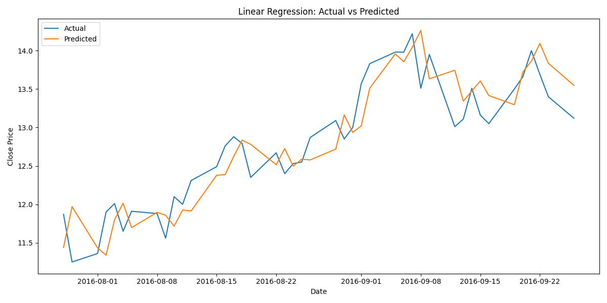

# Análise de PTR4 - Regressão Linear

## 1. Descrição dos dados

Período analisado: 2015-12-04 até 2016-09-26

Número de observações usadas: 212

Colunas utilizadas (Features):

Open, High, Low, Volume, Return, LogReturn, MA_5, MA_10, MA_21, MA_50, STD_5, STD_10, STD_21, STD_50, Volatility_21, HL_Range, OC_Range, DayOfWeek, Close_lag1, Close_lag2, Close_lag3, Return_lag1, Return_lag2, Return_lag3, Volume_lag1, Volume_lag2, Volume_lag3

## 2. Etapas realizadas

- Filtragem por ticker - Criação de variáveis derivadas (médias móveis, volatilidade, retornos, ranges) - Divisão temporal treino/teste (80/20) - Treinamento do modelo: Regressão Linear - Avaliação com MAE, RMSE e R2

## 3. Resultados do modelo

### Linear Regression

MAE: 0.285897  RMSE: 0.119801  R2: 0.805005  

## 4. Conclusões

O modelo de regressão linear para PTR4 apresenta R² = 0,81, indicando que explica cerca de 81% da variação diária do preço.
Com MAE ≈ 0,29 e RMSE ≈ 0,12, os erros médios são baixos em relação aos preços, representando cerca de 2% do valor médio.
Em resumo, o modelo é bastante eficaz para uma regressão linear simples, capturando bem a tendência diária de PTR4.